# Automated EDR-SOAR Security Playbook

Welcome to my Endpoint Detection and Response (EDR) and Security Orchestration, Automation, and Response (SOAR) home lab project. 

The objective of this project is to create an automated playbook that actively responds to alert detections. When a threat is detected, LimaCharlie (EDR) sends the event output to Tines (SOAR). Tines then routes an interactive alert to a Slack channel, providing a web page link with the option to instantly isolate the infected machine from the network. After the decision is made, Tines sends a follow-up message confirming the action taken.

## Architecture and Tooling
*   **EDR:** LimaCharlie agent deployed for continuous endpoint monitoring.
*   **SOAR:** Tines configured for webhook ingestion, API interaction, and workflow automation.
*   **Victim Machine:** Windows 11 Home.

Here is the overarching flowchart of the project:

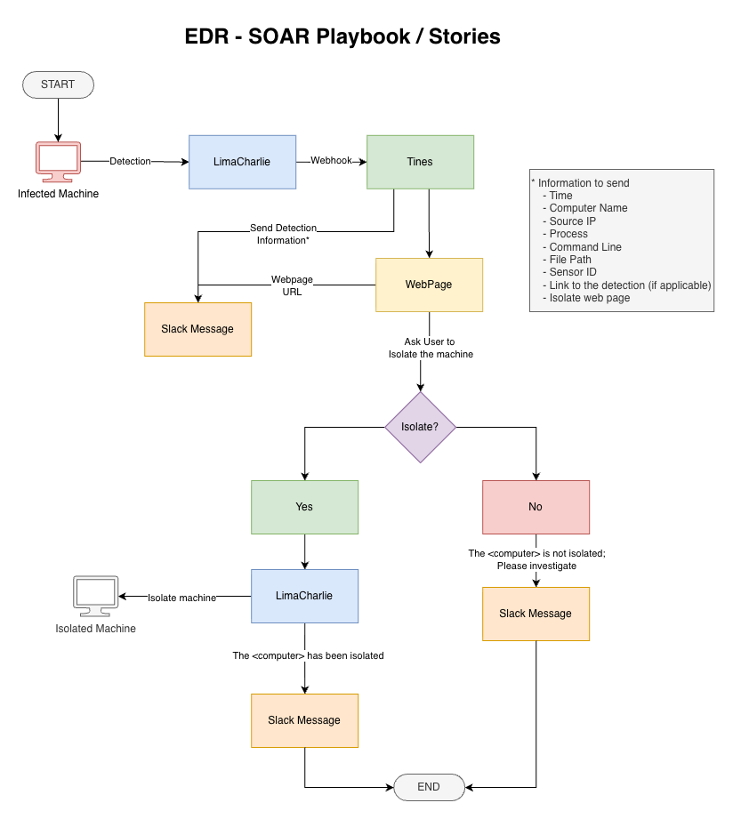

---

## Step 1: EDR Setup and Threat Emulation

I started by installing the LimaCharlie agent sensor on the Windows 11 Home machine. 

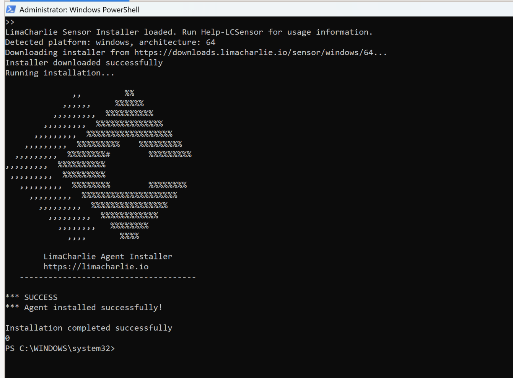

To emulate malicious activity, I downloaded [The LaZagne Project](https://github.com/alessandroz/lazagne), an open-source credential recovery application used to retrieve passwords stored on a local computer. 

After downloading, I executed the payload via PowerShell to analyze the resulting events in LimaCharlie:

```powershell
.\LaZagne.exe browsers
```

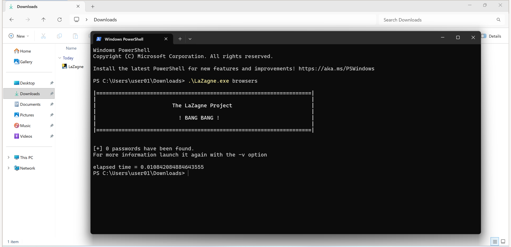

Within seconds, LimaCharlie displayed the event in its Timeline as a `NEW_PROCESS`.

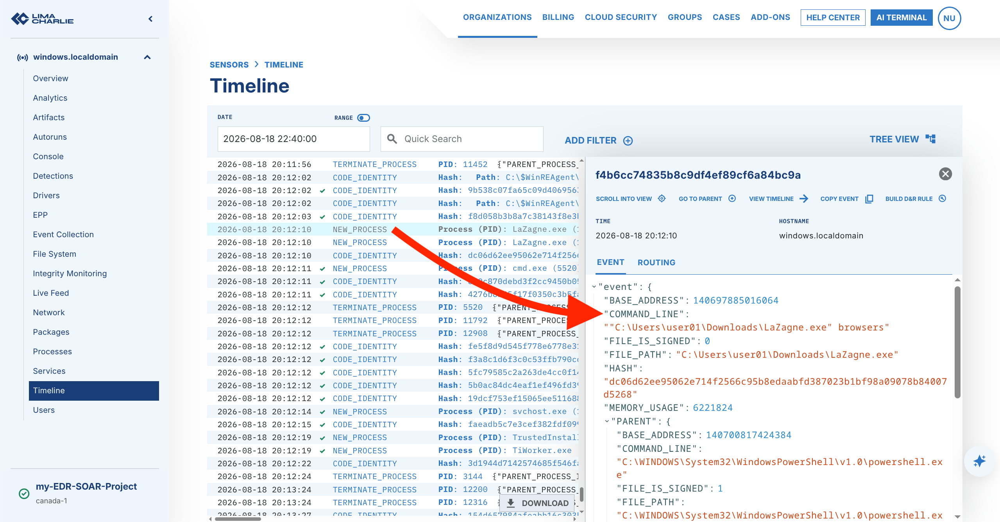

---

## Step 2: Detection Engineering

Next, I analyzed the telemetry and engineered a custom Detection & Response (D&R) rule. To ensure robust detection, the rule triggers based on three distinct criteria:
1. **File Name:** Detects `\LaZagne.exe`.
2. **File Hash:** Detects the specific SHA-256 hash of the executable. 
3. **Behavior / Command Line:** Uses Regex to detect if the payload is executed with typical LaZagne arguments (e.g., `-version`, `-h`, `all`, `browsers`, `wifi`, etc.).

By taking this three-pronged approach, the malware will still be caught if an attacker renames the file or alters its bits (changing the hash). 

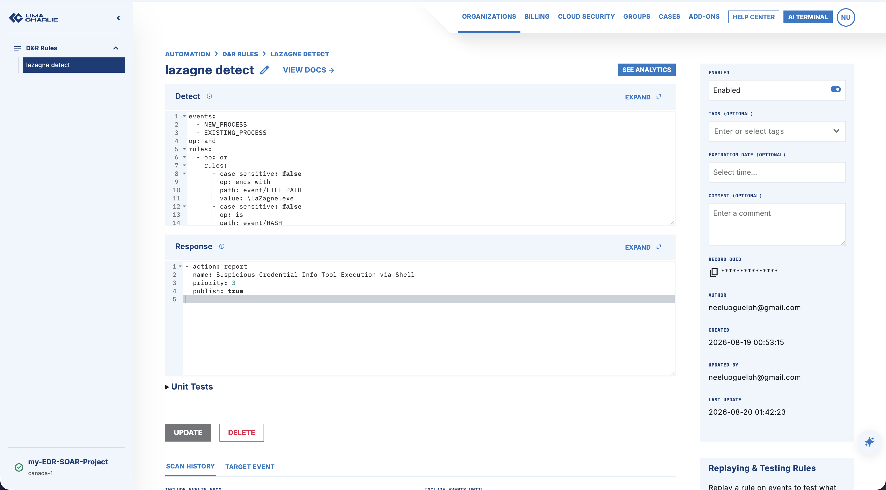 

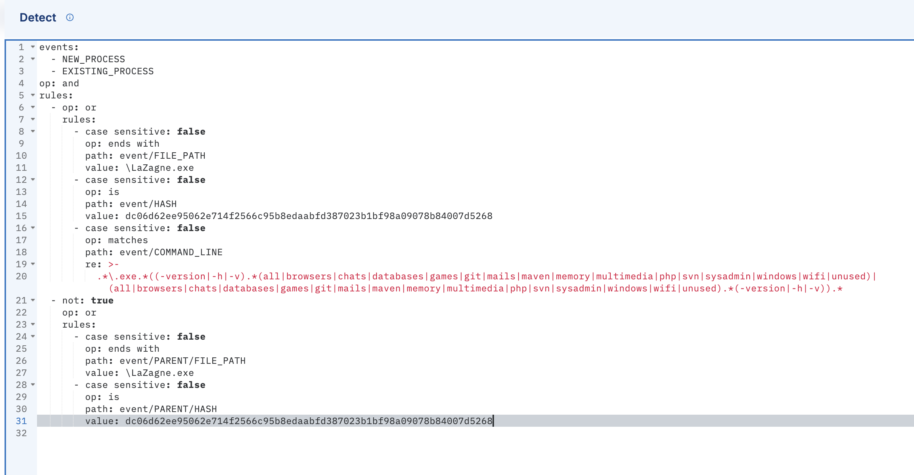

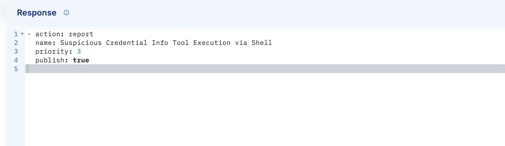

---

## Step 3: SOAR Integration with Tines and Slack

With the detection rule active, I created a Slack channel called `alerts` and set up an account on Tines. 

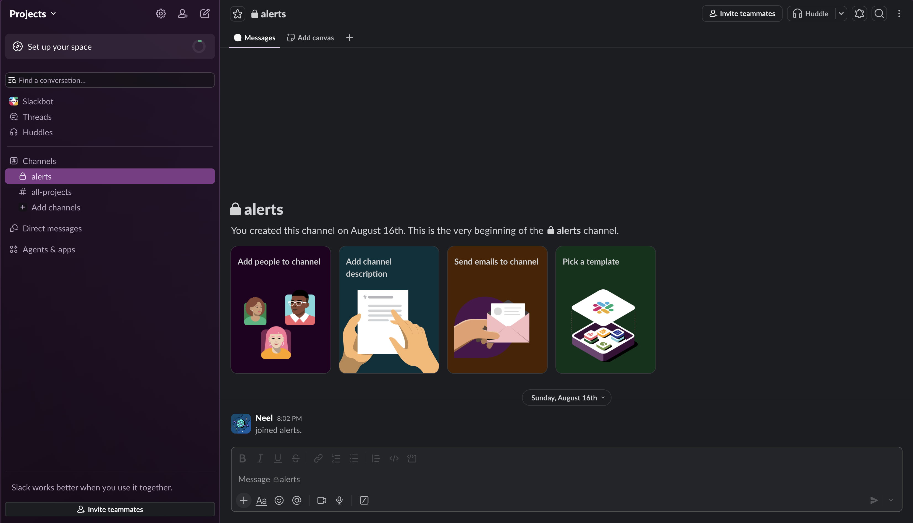

I connected the Slack channel to Tines, added a Tines bot to send messages, and connected LimaCharlie with Tines via a webhook. I also generated an API key with *least privilege access* so Tines could isolate the infected machine.

I then used the following prompt in Tines to generate the SOAR workflow:

```text
When LimaCharlie sends detection webhook, create a web page with details of the event and options to whether isolate the machine of not with Yes or No buttons. Send a slack message containing detection event details and the web page link. When user click on Yes, isolate the host machine. If user selects No, then no further action needed. Send message on Slack with user's decesion. For Information to send use
- Time
- Computer Name
- Source IP
- Process
- Command Line
- File Path
- Sensor ID
- Link to the detection (if applicable)
- Web page Link
```

Based on this prompt, Tines provided a fully functional workflow.

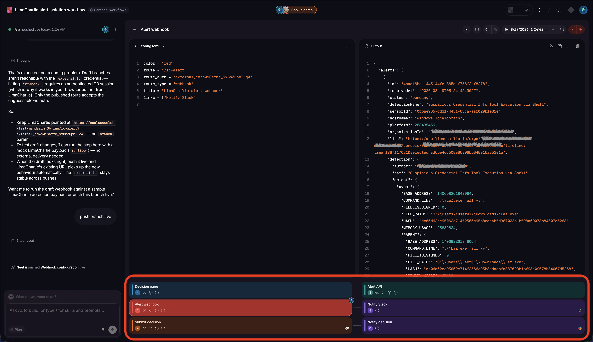

---

## Step 4: Testing and Validation

To test the end-to-end workflow, I ran the command `.\LaZagne.exe all` from the Windows machine. 

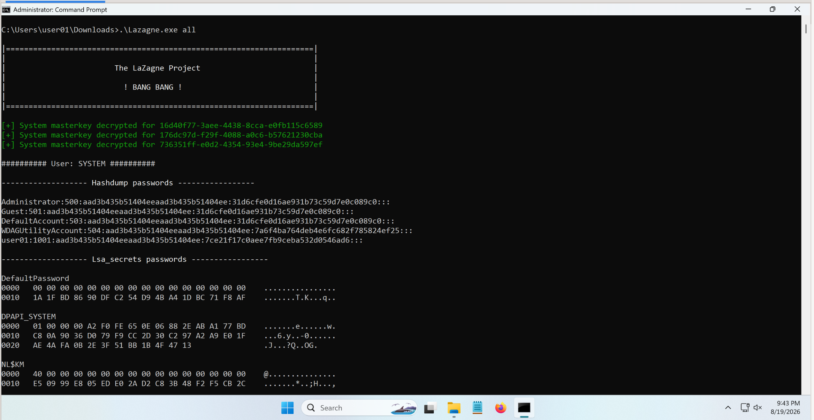

Almost instantly, I received a Slack message containing all the parsed alert information, links to verify the details in LimaCharlie, and a link to the interactive decision webpage.

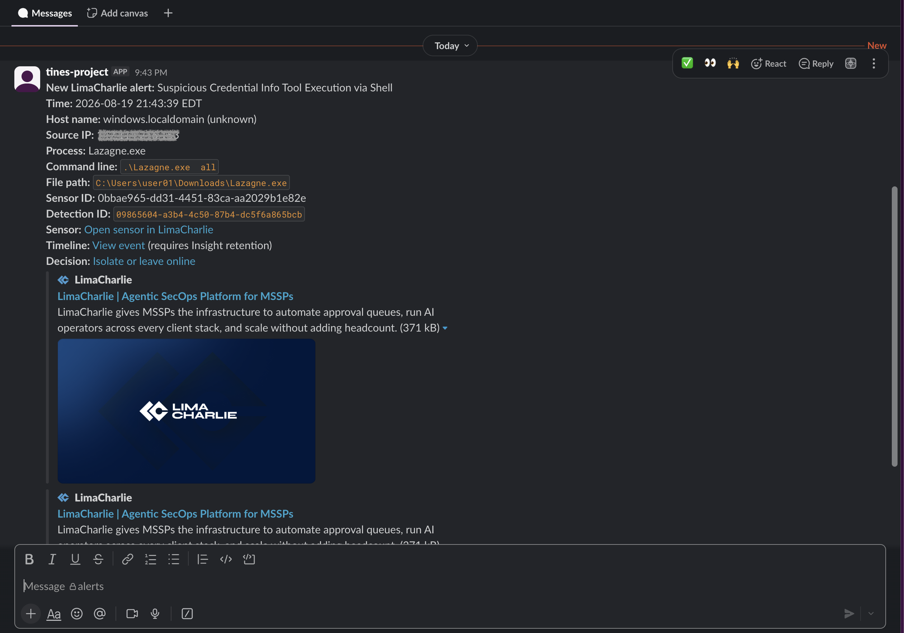

Clicking the sensor and timeline links directed me straight to LimaCharlie for a detailed view:

**Sensor View:**
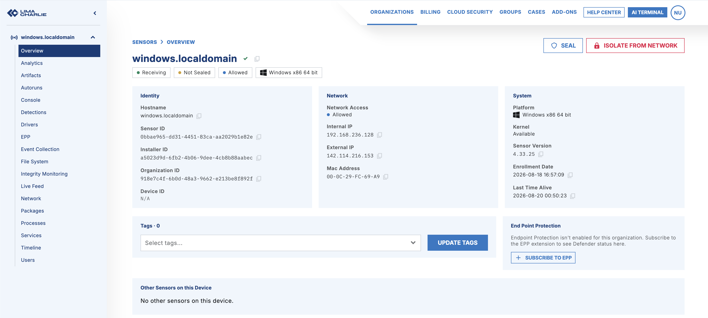

**Timeline View:**
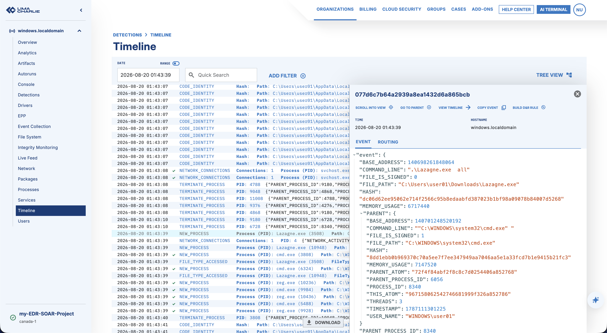

**The Decision Link:**
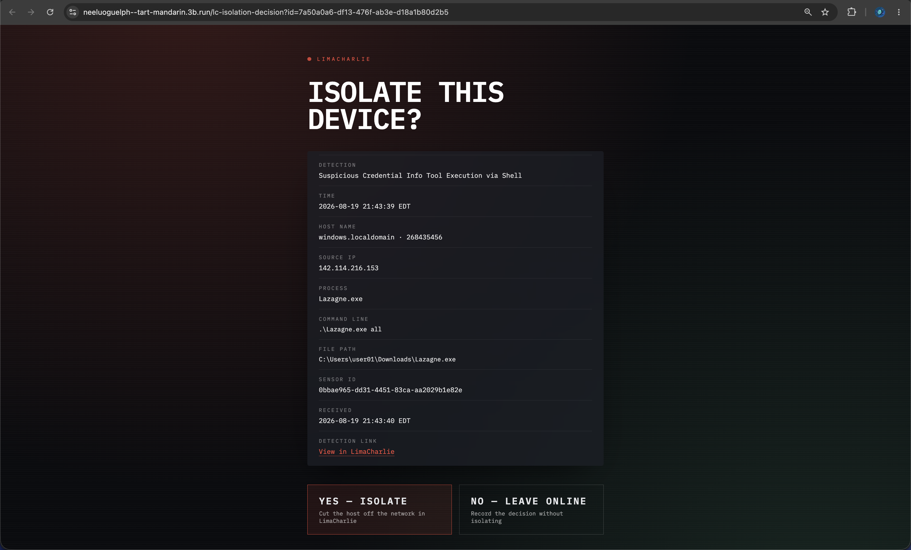

### Validating Network Isolation

To objectively test the isolation action, I started a continuous ping to Google's DNS (`8.8.8.8`) on the victim machine before making a decision.

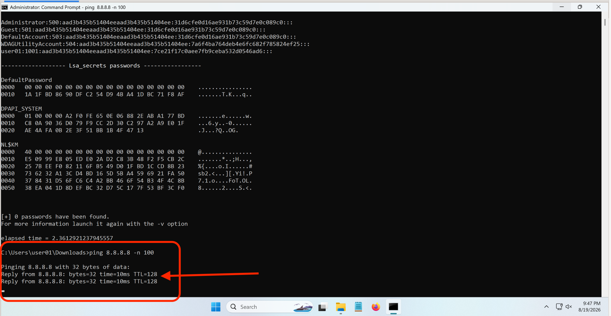

I then clicked the **"Yes - Isolate"** button on the Tines webpage. 

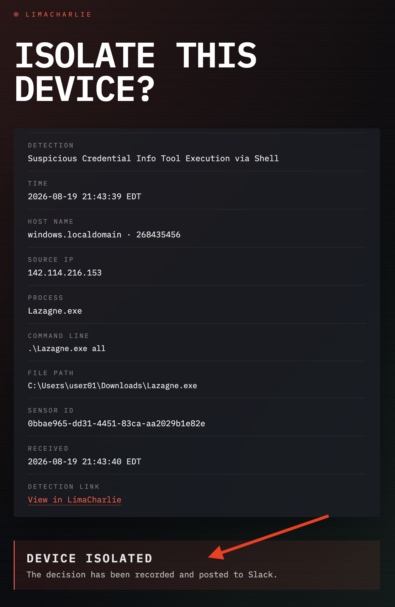

The moment the command was sent to LimaCharlie, the ping started failing, confirming the machine was successfully cut off from the network. 

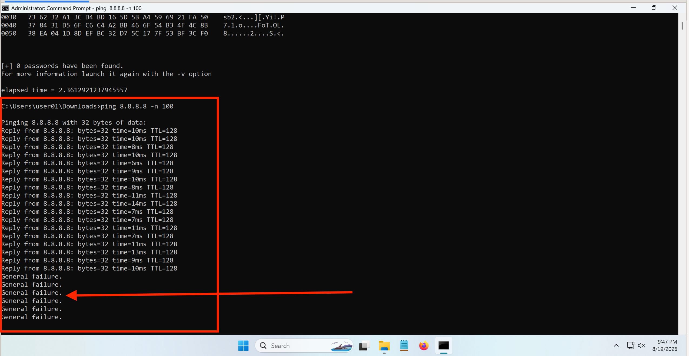

Simultaneously, Tines updated the Slack channel with the confirmation. 

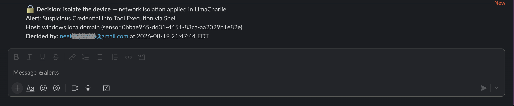

### Validating the "Leave Online" Option

To test the alternative path, I regenerated the alert and selected **"No - Leave Online"**. 

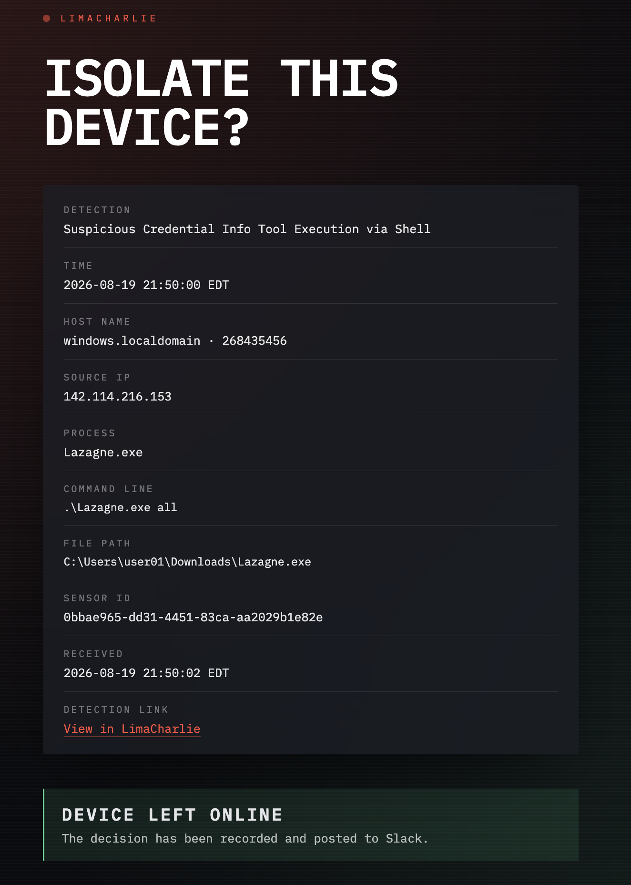

The workflow successfully bypassed the isolation step and posted the corresponding log back to Slack. 


## Conclusion 
Through this project, I gained hands-on experience with EDR telemetry, engineered custom detection rules using Regex, and successfully automated incident response using SOAR. It demonstrated the value of integrating security tools via APIs and webhooks to drastically reduce incident response times.

Feel free to reach out if you have any questions or want to discuss cybersecurity and automation!
[LinkedIn](https://www.linkedin.com/in/sonineelp/)